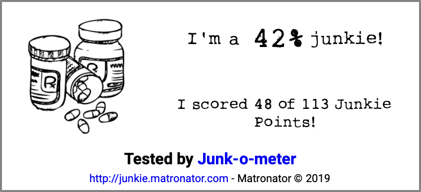

# Junk-o-meter

### How much of a junkie are you?

http://junkie.matronator.com

Do you use drugs? Are you starting to get worried about your drug use? Take this short test to evaluate your drug use and/or addiction and see how you're doing.

(This test is just for fun and isn't based on any actual scientific research, or for that matter any research at all, other than over six years of personal experience with methamphetamine addiction and (ab)use of all sorts of recreational drugs.)

---

#### How it works

You will be asked to answer 21 multiple-choice questions, where each answer has a hidden score value (aka **Junkie Points**). The more Junkie Points you earn, the worse (or better, depends how you look at it) your results will be. At the end, an image with your results will be generated.

**Your answers and results are completely anonymous and are not saved or shared anywhere.**

*This test was made purely for fun and should not be taken as a medical or professional advice. If you or someone you know struggles with addiction, you can find help at some of these resources below.*

[National Institute on Drug Abuse - Contacts](https://www.drugabuse.gov/about-nida/contact-us)  
[NHS - Drug addiction: getting help](https://www.nhs.uk/live-well/healthy-body/drug-addiction-getting-help/)  
[Drugs-forum.com - Harm reduction and addiction support community](https://drugs-forum.com)
